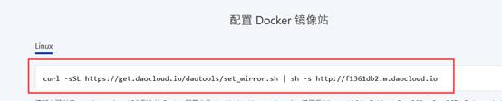

## docker基本操作

使用centos7.4版本以上

http://mirrors.aliyun.com

https://mirrors.aliyun.com/docker-ce/linux/centos/7/x86_64/stable/

镜像站：http://hub.docker.com

​				https://quay.io

修改加速器：https://www.daocloud.io/

查看加速器：docker info

## docker基本操作

使用centos7.4版本以上

http://mirrors.aliyun.com

https://mirrors.aliyun.com/docker-ce/linux/centos/7/x86_64/stable/

镜像站：http://hub.docker.com

​				https://quay.io

修改加速器：https://www.daocloud.io/


安装docker

 


 


安装

```
yum -y install docker-ce
```


查看版本


开启服务

```
systemctl start docker.service 
```

登录之后点击加速器（小火箭）


复制框中内容




### 下载镜像：

```
docker pull busybox
```

 查看下载的镜像：

```
docker images
```

```
docker info
```

删除镜像

```
docker rmi
```

修改镜像名称

```
docker tag centos：7  centos：latest
```

搜索镜像

```
docker search 镜像名
```

保存镜像

docker save -o 保存后的名字   要保存的镜像名字

启动镜像

```
docker run centos；latest /bin/echo “xxxxxx”
```

```
docker ps -a
```

```
docker run -it centos:latest /bin/bash
```


```
docker run -itd --name web1 --restart slways centos:7 /bin/bash
```

把正在运行的容器打包成镜像

```
docker commit web1 hansir/centos-nginx:v1.0.0
```

```
yum  provides 需要安装的服务名  -y
```

导入导出

```
docker export web1 > newcentos.tar
cat newcentos.tar | docker import - newcentos.tar 
docker images
docker run -it newcentos.tar:latest /bin/bash
```

